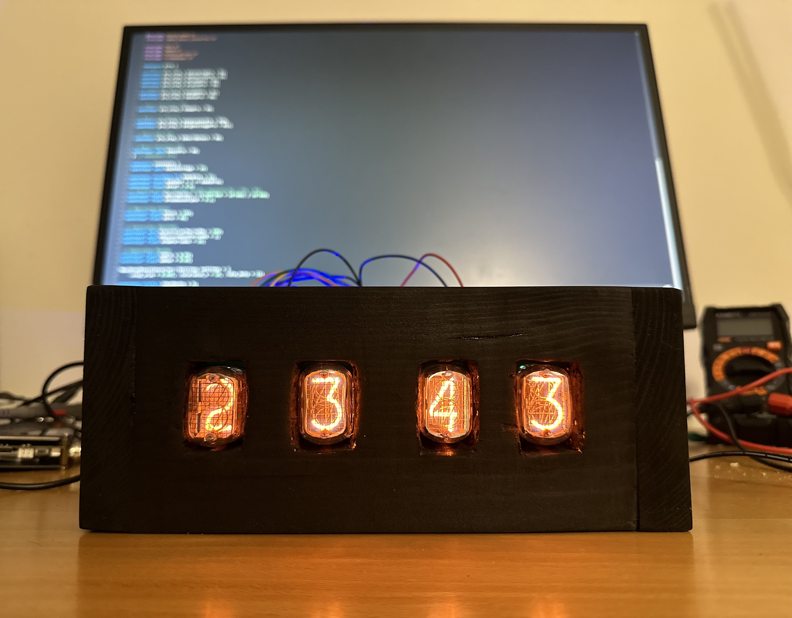

# Nixie Clock
This repository contains the code and schematics for building a clock out of [Nixie Tubes](https://en.wikipedia.org/wiki/Nixie_tube).

Here's what the final product looks like:

## Navigating the Repo
All the Arduino code is the `nixie-clock` directory. I wrote it for the Arduino Nano BLE.

Schematics are found in the `schematics` directory. They can be loaded into [KiCAD](https://www.kicad.org).

The Jupyter notebooks I wrote to understand how the boost converter works live in the `analysis` directory.
